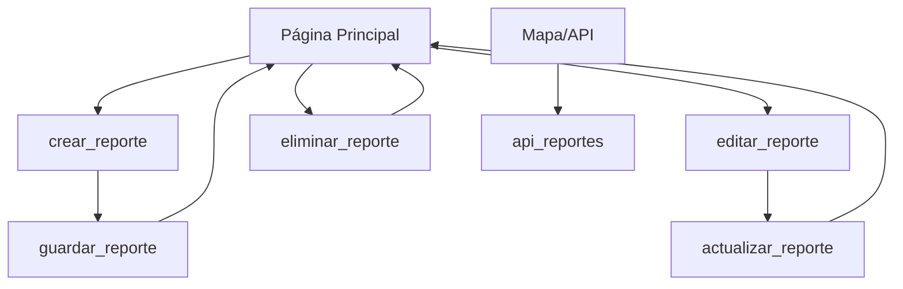
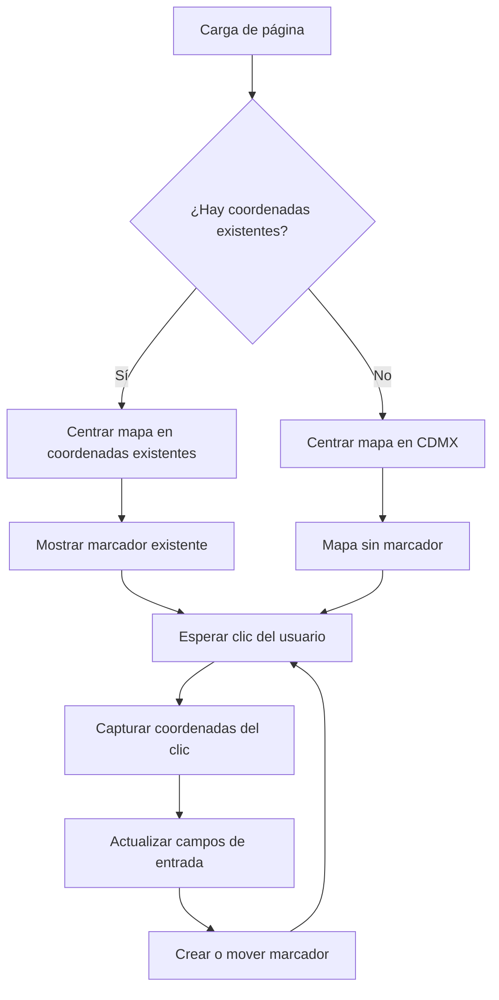
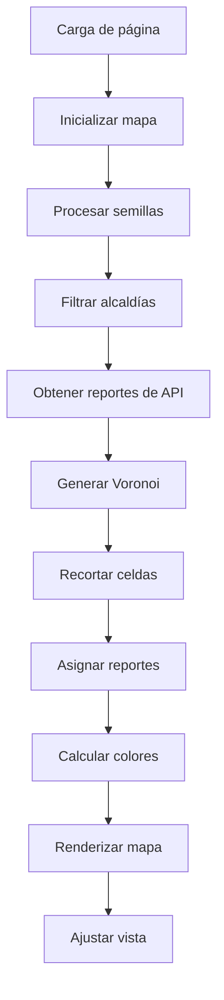

# **Sistema geográfico para la gestión de reportes de incidencias delictivas**

[](URL_DEL_REPOSITORIO)

Descripción de la aplicación.
> Este proyecto es una aplicación web CRUD (Crear, Leer, Actualizar, Borrar) desarrollada en **Django** que permite gestionar la ubicación y los datos de distintos reportes sobre incidencias delictivas ocurridas en la CDMX, utilizando como gestor de bases de datos **POSTGRESQL** con la extensión **PostGIS** para el manejo de datos geográficos. Fue desarrollado como parte de mi servicio social. Además, el sistema permite agrupar las ubicaciones de las incidencias y mostrar un mapa de calor que permite ver que grupos en que área geográfica tienen mas o menos incidencias reportadas.

Objetivo.
> Esta es la primer etapa de un proyecto que se desea permita que las autoridades lleven un **control** y **organizacion** de todos los reportes sobre actos delictivos que ocurren en la ciudad para una mayor organizacion. También podría servir de recurso de consulta para que los ciudadanos se enteren de hechos delictivos cerca o en sus comunidades y hacer un senso de los que podrían ser los lugares con mayor índice delictivo de la capital.

---

## 1. Tecnologías Clave

Lista de las herramientas y tecnologías principales utilizadas en el proyecto.

| Capa | Componente | Versión Utilizada | Próposito |
| :--- | :--- | :--- | :--- |
| **Web Framework Backend** | Django con python **3.12.1** | **4.2.11** | Backend principal, ORM y sistema de rutas. |
| **Web Frontend** | HTML5, CSS3, Bootstrap | **5.3.6** (Bootstrap) | |
| **Mapeo Frontend** | Leaflet.js | **1.9.4** | Renderizado interactivo del mapa en el navegador. |
| **Base de Datos** | PostgreSQL | **16.9** | Almacenamiento de datos relacionales. |
| **Extensiones Geo** | PostGIS | **3.4.2** | Habilita tipos de datos (`PointField`) y funciones espaciales. |
| **Adaptador Python** | psycopg2-binary | **2.9.10** | Conexión de Django a PostgreSQL. |
| **Interoperabilidad** | GDAL | **3.11.0** | Motor de importación y exportacion de datos geoespaciales entre muchos formatos (Shapefile, KML, CSV, etc.). |
| | GEOS | **3.12.1** | Motor matemático para operaciones espaciales y validación entre geometrías. |
| | PROJ | **8.2.1** | Motor de proyección y transformación de coordenadas. |
| **Herramienta GIS** | QGIS | **3.40.8**| Software de escritorio para la visualización, edición y validación de datos en PostGIS. |

---

## 2. Configuración del Entorno (Guía Rápida)

Sigue estos pasos para tener la aplicación funcionando en tu máquina local.

### 2.1. Prerrequisitos

Asegúrate de tener instalado:

* Python
* Pip (Administrador de paquetes de Python)
* Git
* PostgreSQL **[VERSIÓN]** con la extensión **PostGIS** instalada.

### 2.2. Instalación y Puesta en Marcha

1.  **Clonar el repositorio:**
    ```bash
    cd /ruta/NOMBRE_DE_CARPETA/ # Navega a la carpeta donde quieres clonarlo
    git clone https://github.com/AngelFlores123/GestionIncidenciasDelictivas-Django.git
    ```

2.  **Crear y activar el entorno virtual:**
    ```bash
    python -m venv venv
    venv\Scripts\activate   # En Windows
    ```

3.  **Instalar dependencias de Python:**
    ```bash
    pip install -r requirements.txt
    ```

4.  **Configurar la Base de Datos:**
    * Crea una base de datos en PostgreSQL (ej: `my_app_db`).
    * **Importante:** Habilita la extensión PostGIS en la base de datos:
        ```sql
        CREATE EXTENSION postgis;
        ```
    * Asegúrate de que tu archivo `settings.py` en el proyecto Django esté configurado con las credenciales de tu base de datos.
      ```bash
      DATABASES = {
      'default': {
        'ENGINE': 'django.contrib.gis.db.backends.postgis',  # No 'django.db.backends.postgresql'
        'NAME': 'my_app_db',
        'USER': '...',
        'PASSWORD': '...',
        'HOST': 'localhost',
        'PORT': '5432',
       }
      }
      ```
    * Modifica las rutas de las librerias al final de `settings.py`:
      ```bash
      GDAL_LIBRARY_PATH = r'C:\Users\...\envs\geodjango_env\Library\bin\gdal.dll'
      GEOS_LIBRARY_PATH = r'C:\Users\...\envs\geodjango_env\Library\bin\geos_c.dll'
      ```

    * Para cargar datos de un archivo, geojson o shapefile, a la base de datos, hacer lo siguiente:
    1. Vamos a usar la herramienta de GDAL llamada `ogr2ogr`.
    2. Con el software QGIS instalado, abrir la consola `OSGeo4W Shell`.
    3. Dentro, dirigete a la carpeta donde se encuentra el dataset.
       ```bash
       cd C:User/ruta/carpeta
       ```
    4. Ejecuta el siguiente comando (quitar `-nlt MultiPolygon` si el dataset solo contiene puntos, lineas o poligonos simples):
       ```bash
       ogr2ogr -f "PostgreSQL" PG:"dbname=NOMBRE_DE_TU_BD host=localhost port=5432 user=TU_USUARIO password=TU_CONTRASENA" "NOMBRE_DATASET.geojson/.shp" -nlt MultiPolygon
       ```
    5. Ahora podrá ver sus datos en una tabla en su base de datos.

5.  **Ejecutar Migraciones:**
    * Ejecutar en la terminal en la raíz de proyecto con el entorno virtual activado:
    ```bash
    python manage.py makemigrations
    python manage.py migrate
    ```

6.  **Iniciar el Servidor:**
    ```bash
    python manage.py runserver
    ```
    La aplicación estará disponible en: `http://127.0.0.1:8000/`

---

## 3. Estructura y Modelos de Datos

### 3.1. Arquitectura de Apps de Django

| App | Propósito | URL Base |
| :--- | :--- | :--- |
| `sid` | Configuraciones principales del proyecto. | NA |
| `principal` | Contiene los Modelos, Vistas y Templates para el CRUD de **[ENTIDAD]**. | `/` |

### 3.2. Modelo Geográfico Principal

El modelo principal es **ReportesIncidenciau** ubicado en `principal/models.py`. En este se definen algunos de los aspectos más importantes de un reporte.
```python
class ReportesIncidenciau(models.Model):
    gid = models.AutoField(primary_key=True)
    id_delito = models.CharField()
    delito = models.CharField()
    categoria_delito = models.CharField()
    impacto_delito = models.CharField()
    anio_hecho = models.IntegerField()
    mes_hecho = models.CharField()
    alcaldia = models.CharField()
    cve_col = models.CharField()
    colonia = models.CharField()
    latitud = models.FloatField()
    longitud = models.FloatField()
    geom = models.PointField(srid=32614) # Sistema de Referencia de Coordenadas (CRS) WGS 84
```

Para poder delimitar las funciones que se explican más adelante en un mapa, fue necesario obtener un dataset con la geometría de las alcaldías de la CDMX (en conjunto definen el área de la capital). Estos datos los puedes descargar de la página Límite de Alcaldías (áreas geoestadísticas municipales) de INEGI. Url: https://datos.cdmx.gob.mx/dataset/alcaldias#:~:text=En%20este%20conjunto%20encontrar%C3%A1s%20los%20pol%C3%ADgonos%20que%20definen,sobre%20este%20conjunto%20de%20datos%3F%20Cont%C3%A1ctanos%20por%20correo.
El modelo fue generado áutomaticamente por el ORM de Django a partir de este dataset.
```python
class LimiteDeLasAlcaldas(models.Model):
    laid = models.AutoField(primary_key=True)
    wkb_geometry = models.PolygonField(blank=True, null=True)
    cvegeo = models.CharField(blank=True, null=True)
    cve_ent = models.CharField(blank=True, null=True)
    cve_mun = models.CharField(blank=True, null=True)
    nomgeo = models.CharField(blank=True, null=True)
```

---

## 4. Flujo de Datos y Lógica de Negocio

### 4.1 Funcionalidad principal: App `principal`

#### 4.1.1. Vistas (`views.py`)

### **`home(request)`**

#### Descripción general
Esta es una vista compleja que combina el filtrado con la preparación de datos geográficos (GeoJSON y puntos) para el frontend. En ella de enlista reportes de incidencias delictivas con filtros, paginación y datos para el mapa.

#### Parámetros de entrada
* request: HttpRequest con parametros GET opcionales.

| Parámetro | Tipo | Descripción |
| :--- | :--- | :--- |
| categoria_filtro | string | Filtra por categoría de delito |
| impacto_filtro | string | Filtra por impacto del delito |
| alcaldia_filtro | string | Filtra por alcaldía |
| fecha_filtro | string | Ordena por fecha (`mas reciente` o `menos reciente`)|
| grupos_incidencias | string | Número de semillas para agrupación (10 por default) |
| page | string | Número de página para paginación |
```python
    categoria = request.GET.get('categoria_filtro')
    impacto = request.GET.get('impacto_filtro')
    alcaldia = request.GET.get('alcaldia_filtro')
    fecha = request.GET.get('fecha_filtro')
    gruposIncidencias = request.GET.get('grupos_incidencias')
```

#### Funcionalidad
1. **Obtencion de datos base**
```python
reportes_list = ReportesIncidenciau.objects.all()
cdmx_division = LimiteDeLasAlcaldas.objects.all()
```
Obtiene todos los reportes y los límites de alcaldías de la base de datos.

2. **Sistema de filtros**
* Categoría: `categoria_delito__icontains`
* Impacto: `impacto_delito__icontains`
* Alcaldía: `alcaldia__icontains`
* Fecha: 'mas reciente': `order_by('-anio_hecho')`; 'menos reciente': `order_by('anio_hecho')`
El resultado del filtrado se úsara en el paginador.

4. **Paginación**
Se muestran 15 reportes por página con `Paginator`

6. **Generación de semillas de agrupación**
* Se selecciona n reportes aleatorios como semillas.
* n es por grupos_incidencias (default: 10).
* Si hay filtro por alcaldía, las semillas se toman de esa alcaldía.

8. **Conversión a GeoJSON**
* Convierte límites de alcaldías a GeoJSON para el mapa.

#### Contexto de salida
| Variable | Tipo | Descripción |
| :--- | :--- | :--- |
| `reportesID` | Page | Reportes paginados |
| `categoria` | string | Categoría filtrada |
| `impacto` | string | Impacto filtrado |
| `alcaldia` | string | Alcaldía filtrada |
| `fecha` | string | Filtro de fecha |
| `gruposIncidencias` | string | Número de grupos de voronoi |
| `semillas` | JSON string | Semillas para la agrupación |
| `cdmx_division` | JSON string | Límites de alcaldías en GeoJSON |

#### Template de salida
* Template: `principal.html`
* Próposito: Página principal con mapa y lista de reportes con acciones.

#### Dependencias
* Modelo ReportesIncidenciau
* Modelo LimiteDeLasAlcaldas
* Paginator
* JSON
* serialize (GeoJSON)

### **`crear_reporte(request)`**

#### Descripción
Muestra el formulario para crear un reporte.

#### Parámetros de entrada
* request: HttpRequest

#### Funcionalidad
Renderiza el template `crear_reporte.html`.

#### Template de salida
* Template: `crear_reporte.html`
* Propósito: Página que muestra un formulario con los campos para que el usuario genere un nuevo reporte.

### **`guardar_reporte(request)`**

#### Descripción
Crea un reporte con datos POST.

#### Parámetros de entrada
* request: HttpRequest con datos POST.

#### Campos POST requeridos
| Campo | Tipo | Descripción |
| :--- | :--- | :--- |
| `anio_hecho` | string | Año del hecho |
| `mes_hecho` | string | Mes del hecho |
| `hora_hecho` | string | Hora del delito |
| `delito` | string | Descripcion del delito |
| `categoria_delito` | string | Categoría del delito |
| `impacto_delito` | string | Impacto del delito |
| `alcaldia` | string | Alcaldía donde ocurrió |
| `cve_col` | string | Clave de la colonia |
| `colonia` | string | Nombre de la colonia |
| `latitud` | string | Latitud donde ocurrio el delito |
| `longitud` | string | Longitud donde ocurrio el delito |

#### Funcionalidad
* Genera id_delito con año + mes + hora.
* Crea geometría WKT: sistema de referencia SRID=32614; la geometría es un punto POINT(longitud latitud).
* Crea el reporte en la base de datos.
* Redirige a la página principal.

#### Redirección
* Template: `principal.html`

### **`eliminar_reporte(request, gid)`**

#### Descripción
Elimina un reporte por gid.

#### Parámetros
* request: HttpRequest
* gid: ID del reporte

#### Funcionalidad
* Busca el reporte con get_object_or_404.
* Elimina el registro.
* Redirige a la página principal.

#### Manejo de Errores
* 404 si no existe.

#### Redirección
* Template: `principal.html`

### **`editar_reporte(request, gid)`**

#### Descripción
Muestra el formulario de edición y el mapa del reporte.

#### Parámetros
* request: HttpRequest
* gid: ID del reporte

#### Funcionalidad
* Busca el reporte con `get_object_or_404`, para manejo de errores en caso de que no se encuentre el reporte.
* Renderiza `editar_reporte.html` con el reporte.

#### Contexto
| Variable | Tipo | Descripción |
| :--- | :--- | :--- |
| `reporte` | ReportesIncidenciau | Reporte que se va a editar |

#### Template de salida
* Template: `editar_reporte.html`

#### Manejo de Errores
* 404 si no existe.

### **`actualizar_reporte(request, gid)`**

#### Descripción
Actualiza un reporte con datos POST.

#### Parámetros
* request: HttpRequest con datos POST
* gid: ID del reporte

#### Campos POST
| Campo | Tipo | Descripción |
| :--- | :--- | :--- |
| `id_delito` | string | Identificador del delito |
| `anio_hecho` | string | Año del hecho |
| `mes_hecho` | string | Mes del hecho |
| `hora_hecho` | string | Hora del delito |
| `delito` | string | Descripcion del delito |
| `categoria_delito` | string | Categoría del delito |
| `impacto_delito` | string | Impacto del delito |
| `alcaldia` | string | Alcaldía donde ocurrió |
| `cve_col` | string | Clave de la colonia |
| `colonia` | string | Nombre de la colonia |
| `latitud` | string | Latitud donde ocurrio el delito |
| `longitud` | string | Longitud donde ocurrio el delito |

#### Funcionalidad
* Busca el reporte con `get_object_or_404`.
* Actualiza los campos.
* Recalcula la geometría WKT.
* Guarda los cambios.
* Redirige a la página principal.

#### Manejo de Errores
* 404 si no existe.
Redirección

#### Redirección
* Template: `principal.html`

### **`api_reportes`**
  
#### Descripción
API que devuelve reportes en JSON para el mapa.

#### Parámetros de entrada
* request: HttpRequest
  
#### Funcionalidad
* Obtiene gid, alcaldia, latitud, longitud de todos los reportes.
* Devuelve JSON con JsonResponse.
  
#### Respuesta
```json
[
  {
    "gid": 1,
    "alcaldia": "Álvaro Obregón",
    "latitud": 19.3456,
    "longitud": -99.1234
  },
  ...
]
````

* **Flujo de interaccion**


#### 4.1.3. Static (funcionamiento de los mapas)

### **`mapa.js`**

#### Descripción General
Inicializa un mapa interactivo con Leaflet para seleccionar coordenadas en formularios de reportes.

#### Funcionalidad Principal
1. **Inicialización del Mapa**
```javascript
document.addEventListener("DOMContentLoaded", function(){
```
* Se ejecuta al cargar el DOM.

2. **Configuración Inicial**
```javascript
var iniLat = 19.432608;  // Latitud inicial (CDMX)
var iniLng = -99.133209; // Longitud inicial (CDMX)
```
* Coordenadas por defecto en Ciudad de México.

3. **Obtención de Coordenadas Existentes**
```javascript
var latInput = document.getElementById('latitud');
var lngInput = document.getElementById('longitud');
var lat = latInput.value ? parseFloat(latInput.value) : iniLat;
var lng = lngInput.value ? parseFloat(lngInput.value) : iniLng;
```
* Lee `latitud` y `longitud` del formulario.
* Si existen, las usa; si no, aplica las coordenadas por defecto.

4. **Creación del Mapa**
```javascript
var mapa = L.map('mapa').setView([lat, lng], 13);
```
* Crea el mapa en el contenedor `#mapa`.
* Centra en las coordenadas y zoom 13.

5. **Capa de Tiles**
```javascript
L.tileLayer('https://{s}.tile.openstreetmap.org/{z}/{x}/{y}.png', {
    attribution: '© OpenStreetMap contributors'
}).addTo(mapa);
```
* Usa OpenStreetMap con atribución.

6. **Gestión del Marcador**
```javascript
var marcador = null;

// Muestra marcador si hay coordenadas existentes
if (latInput.value && lngInput.value) {
    marcador = L.marker([lat, lng]).addTo(mapa);
}
```
* Si hay coordenadas, coloca un marcador.

7. **Interacción por Clic**
```javascript
mapa.on('click', function(e) {
    var newLat = e.latlng.lat.toFixed(6);
    var newLng = e.latlng.lng.toFixed(6);

    latInput.value = newLat;
    lngInput.value = newLng;

    if (marcador) {
        marcador.setLatLng(e.latlng);
    } else {
        marcador = L.marker(e.latlng).addTo(mapa);
    }
});
```
* Al hacer clic:
  * Captura lat/lng con 6 decimales.
  * Actualiza los inputs.
  * Mueve el marcador o lo crea si no existe.

#### Elementos HTML Requeridos

| Elemento | ID | Tipo | Descripción |
|----------|----|----- |-------------|
| Contenedor del mapa | `mapa` | div | Contenedor para el mapa |
| Campo de latitud | `latitud` | input | Coordenada de latitud |
| Campo de longitud | `longitud` | input | Coordenada de longitud |

#### Dependencias

**Librerías Externas**
* Leaflet.js
* OpenStreetMap tiles

#### HTML Estructura
```html
<div id="mapa" style="height: 400px;"></div>
<input type="hidden" id="latitud" name="latitud" value="">
<input type="hidden" id="longitud" name="longitud" value="">
```

#### Casos de Uso

1. **Crear Nuevo Reporte**
* Mapa centrado en CDMX.
* Sin marcador inicial.
* Clic para colocar marcador y actualizar campos.

2. **Editar Reporte Existente**
* Mapa centrado en las coordenadas del reporte.
* Marcador en la ubicación actual.
* Clic para mover el marcador y actualizar campos.

#### Configuración del Mapa

| Parámetro | Valor | Descripción |
|-----------|-------|-------------|
| Zoom inicial | 13 | Nivel de zoom |
| Centro por defecto | 19.432608, -99.133209 | CDMX |
| Precisión coordenadas | 6 decimales | Precisión de lat/lng |
| Proveedor de tiles | OpenStreetMap | Fuente de mapas |

#### Flujo de Interacción



#### Notas Técnicas
* Coordenadas en WGS84 (EPSG:4326).
* Precisión de 6 decimales (~0.1 m).
* Marcador único por mapa.
* Campos de entrada se actualizan en tiempo real.


### **`mapaPrincipal.js`**

#### Descripción General
Inicializa el mapa principal con diagramas de Voronoi para agrupar incidencias delictivas en la CDMX, ya sea a nivel estatal o por cada alcaldia.

#### Funcionalidad Principal

1. **Inicialización del Mapa**
```javascript
document.addEventListener("DOMContentLoaded", function(){
    var iniLat = 19.432608;  // Latitud inicial (CDMX)
    var iniLng = -99.133209; // Longitud inicial (CDMX)
    
    var mapa = L.map('mapa').setView([iniLat, iniLng], 13);
```
* Se ejecuta al cargar el DOM.
* Centra el mapa en CDMX con zoom 13.

2. **Configuración de Capas Base**
```javascript
L.tileLayer('https://{s}.tile.openstreetmap.org/{z}/{x}/{y}.png', {
    attribution: '© OpenStreetMap contributors'
}).addTo(mapa);
```
* Usa OpenStreetMap como capa base.

3. **Inicialización de Feature Collections**
```javascript
var semillasFC  = turf.featureCollection([]);  // Puntos representativos
var clientesFC  = turf.featureCollection([]);  // Todos los reportes
var cdmx_divFC = turf.featureCollection([]);   // Límites de alcaldías
```
* Crea colecciones con Turf.js para semillas, reportes y límites.

4. **Procesamiento de Semillas**
```javascript
semillas = JSON.parse(semillas);
semillas.forEach(s => {
    const lat = parseFloat(s.latitud);
    const lng = parseFloat(s.longitud);
    if (Number.isFinite(lat) && Number.isFinite(lng)) {
        semillasFC.features.push(
            turf.point([lng, lat], { id: String(s.gid), nombre: s.alcaldia || String(s.gid) })
        );
    }
});
```
* Convierte semillas a puntos y valida coordenadas.
* Agrega las semillas a la coleccion turf.

5. **Filtrado de Alcaldías**
```javascript
if(alcaldia !== 'None'){
    // Filtrar por alcaldía específica
    const alcaldias = cdmx_division.features.filter(cd => cd.properties.nomgeo === alcaldia);
    alcaldias.forEach(cd => {
        const geom = cd.geometry;
        cdmx_divFC.features.push(
            turf.feature(geom, { nombre: cd.properties.nomgeo || 'Desconocida' })
        );
    });
} else {
    // Usar todas las alcaldías
    cdmx_division.features.forEach(cd => {
        const geom = cd.geometry;
        cdmx_divFC.features.push(
            turf.feature(geom, { nombre: cd.nomgeo || 'Desconocida' })
        );
    });
}
```
* Aplica filtro por alcaldía o incluye todas.
* Si `alcaldia` tiene datos (se eligió una alcaldia), se agrega la geometría a la colección turf.
* Si `alcaldia` no tiene datos (contiene un string `none`), significa que no se eligió una alcaldia para filtrar, por lo que todas se agregan a la colección turf. 

6. **Obtención de Reportes desde API**
```javascript
fetch('/api/reportes/')
    .then(response => response.json())
    .then(reportes => {
        reportes.forEach(r => {
            const lat = parseFloat(r.latitud);
            const lng = parseFloat(r.longitud);
            if(Number.isFinite(lat) && Number.isFinite(lng)){
                clientesFC.features.push(
                    turf.point([lng, lat], { clienteId: String(r.gid) })
                );
            }
        });
```
* Carga reportes y los convierte a puntos.
* Se obtienen los datos asíncronamente desde la api de la vista `api_reportes` en el backend.

7. **Generación del Diagrama de Voronoi**
```javascript
const bboxCDMX = turf.bbox(cdmx_divFC);
let vor = turf.voronoi(semillasFC, { bbox: bboxCDMX });
```
* Genera Voronoi usando el bbox de CDMX.
* El bbox es un área rectangular que abarca todos los puntos de la colección `cdmx_divFC`.

8. **Recorte de Celdas por Límites de Alcaldías**
```javascript
vor.features = vor.features.map(cell => {
    let clipped = null;
    cdmx_divFC.features.forEach(alcaldiaPoly => {
        const inter = turf.intersect(cell, alcaldiaPoly);
        if (inter) {
            if (!clipped) {
                clipped = inter;
            } else {
                clipped = turf.union(clipped, inter);
            }
        }
    });
    return clipped ? clipped : null;
}).filter(cell => cell !== null);
```
* Recorta celdas con los límites de alcaldías.
* El área de la celda de voronoi que se recortará no tendrá que tener intersección con el área de ninguna alcaldía.

9. **Asignación de Reportes a Celdas**
```javascript
const asignaciones = {};
vor.features.forEach((cell, idx) => {
    const pin = turf.pointOnFeature(cell);
    const semillaCercana = turf.nearestPoint(pin, semillasFC);
    const semillaId = semillaCercana.properties.id;
    const semillaAlcaldia = semillaCercana.properties.alcaldia || semillaId;

    cell.properties = cell.properties || {};
    cell.properties.semillaId = semillaId;
    cell.properties.semillaAlcaldia = semillaAlcaldia;
    cell.properties._idx = idx;

    const ptsIn = turf.pointsWithinPolygon(clientesFC, cell);
    asignaciones[semillaId] = ptsIn.features;
    cell.properties.cantidadClientes = ptsIn.features.length;
});
```
* Se elige un punto aleatorio dentro de la celda.
* Se busca una semilla cerca a dicho punto, esta será la semilla de la celda.
* Asigna reportes a cada celda y el conteo de estos para después mostrar la cantidad en el mapa. 
* Se guarda metadatos en la celda, algunos son de la semilla.

10. **Función de Coloreado**
```javascript
function colorPorCantidad(cantidad, min, max){
    const t = (cantidad - min) / (max - min);
    const r = Math.round(30 + t * (239 - 30)); 
    const g = Math.round(64 + t * (68 - 64));
    const b = Math.round(175 + t * (68 - 175));
    return `rgb(${r},${g},${b})`;
}
```
* Mapea cantidad a color (azul a rojo). Se calcula un color basado en la cantidad de incidencias.
* Se normaliza la cantidad entre 0 y 1.
* Se usa la escala de azul a rojo en RGB.

 11. **Renderizado de la Capa de Voronoi**
```javascript
const vorLayer = L.geoJSON(vor, {
    style: f => ({
        color: '#111827',
        weight: 1.2,
        fillColor: colorPorCantidad(f.properties.cantidadClientes, minCant, maxCant),
        fillOpacity: 0.45
    }),
    onEachFeature: (f, layer) => {
        layer.bindPopup(`Incidencias en esta seccion: <b>${f.properties.cantidadClientes}</b><br>`);
        layer.on('mouseover', e => e.target.setStyle({ weight: 2.2, fillOpacity: 0.4 }).bringToFront());
        layer.on('mouseout', e => vorLayer.resetStyle(e.target));
    }
}).addTo(mapa);
```
* Aplica estilos y eventos a cada celda.

12. **Ajuste de Vista**
```javascript
mapa.fitBounds(vorLayer.getBounds());
```
* Ajusta la vista a las celdas.

#### Variables Globales Requeridas

| Variable | Tipo | Descripción |
|----------|------|-------------|
| `semillas` | JSON string | Puntos representativos para Voronoi |
| `cdmx_division` | JSON string | Límites de alcaldías en GeoJSON |
| `alcaldia` | string | Alcaldía filtrada ('None' para todas) |

#### Dependencias

**Librerías Externas**
* Leaflet.js
* Turf.js
* OpenStreetMap tiles

#### APIs Internas
* `/api/reportes/` Endpoint para obtener reportes

#### Elementos HTML Requeridos

| Elemento | ID | Tipo | Descripción |
|----------|----|----- |-------------|
| Contenedor del mapa | `mapa` | div | Contenedor para el mapa principal |

#### Algoritmo de Agrupación

1. **Generación de Semillas**
* Selección aleatoria de puntos representativos.
* Cantidad configurable (default: 10).

2. **Diagrama de Voronoi**
* Celdas por semilla.
* Recorte con límites de alcaldías.

3. **Asignación de Reportes**
* Cada reporte se asigna a la celda más cercana.
* Conteo por celda.

4. **Visualización**
* Color por densidad.
* Popups con conteos.

#### Escala de Colores

| Cantidad | Color | Descripción |
|----------|-------|-------------|
| Mínima | Azul (#1e40af) | Pocas incidencias |
| Intermedia | Verde-Amarillo | Incidencias moderadas |
| Máxima | Rojo (#ef4444) | Muchas incidencias |

#### Flujo de Procesamiento



#### Características Interactivas

**Popups**
* Muestran cantidad de incidencias por celda.

**Efectos Hover**
* Resaltado al pasar el mouse.

#### Responsive
* Ajuste automático de la vista.

### Notas Técnicas

* Coordenadas en WGS84 (EPSG:4326).
* Voronoi recortado por límites administrativos.
* Coloreado por densidad de incidencias.
* Manejo de errores para Voronoi vacío.
* Optimización con filtrado de celdas nulas.

---
